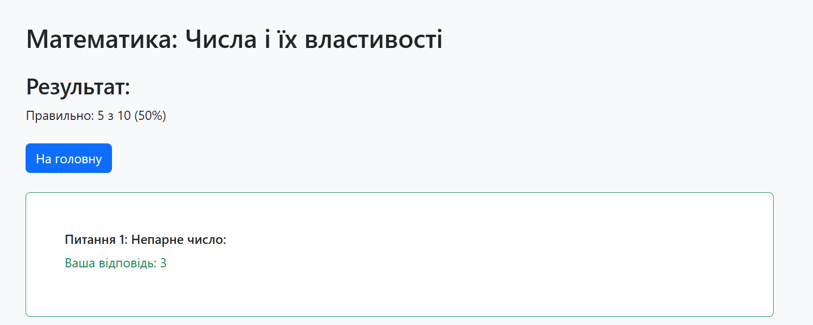
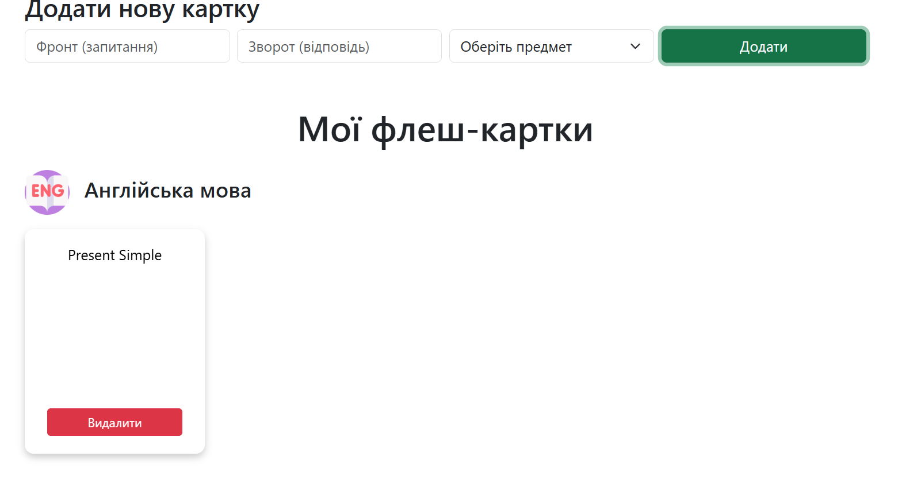

**Головна**

При вході на сторінку користувач бачить головну сторінку, на якій він може одразу вибрати предмет, з якого він хоче пройти тест.

**Вибір теми**

Після настискання на кнопку перейти до тесту. Користувач переходить на сторінку вибору теми, з якої він хоче пройти тестування.

**Проходження тесту**

На сторінці з тестами користувач послідовно відповідає на запитання (варто відмітити, що питання перемішуються кожного нового запуску теста). Повернутися до попередніх питань неможливо. 
Після визначення правильної відповіді користувач має відмітити відповідь у списку та натиснути далі

**Результати тесту**

В результатах користувач бачить як коротку статистику по відповідям (процент правильних відповідей).
Нижче користувач бачить більш детальну статистику. Окрім правильної відповіді виводиться також пояснення відповіді для самоаналізу.
Натиснувши на кнопку "На головну" користувач повертається на головну сторінку, де він може знову вибрати тест.

**Флеш картки**

Натиснувши на пункт меню "Флеш картки" користувач переходить до меню створення своїх флеш карток по окремим предметам.

На цій сторінці користувач може керувати своїми флеш картками. для додавання треба заповнити всі поля форми, а також вибрати предмет.

Після натискання на кнопку створиться картка, і якщо карток відповідного предмету ще не було створено, то разом з карткою створиться категорія (предмета).

При наведенні курсору на картку через 500 мс. вона буде перегорнута, це невеликий механізм захисту від випадкового наведення. Для адаптації до мобільних телефонів перегортання картки на них працює через натискання на картку.

Для видалення картки необхідно натиснути на відповідну кнопку. Предмети з 0 кіл-тю карток не відображаються.

Всього карток можна додати 15, тому при додаванні більшої кількості виводиться помилка
